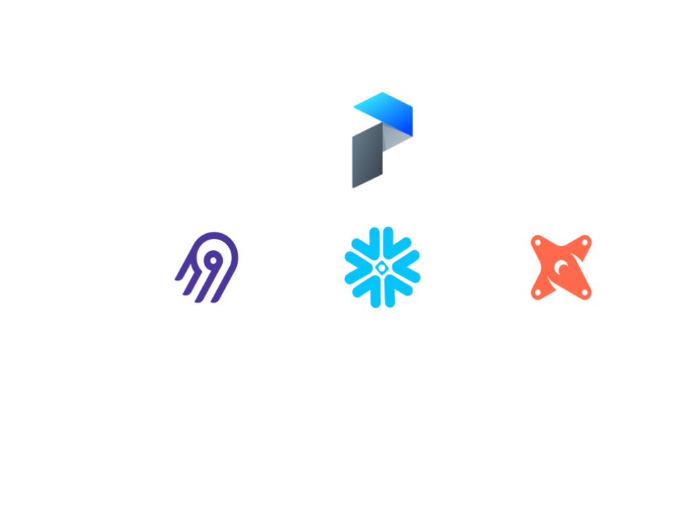

# Putting it all together

Let's take some of the concepts we just explored and build an end-to-end data pipeline, from raw source data to reporting-ready tables in a data warehouse.

## What's our stack?
- [**Prefect**](https://www.prefect.io): our orchestrator
- [**Airbyte**](https://www.airbyte.com): our data integration tool (move data from A to B)
- [**DBT**](https://www.getdbt.com/): our transform tool (build clean tables from raw source data)
- [**Snowflake**](https://signup.snowflake.com): our data warehouse

## What will our data pipeline do?
- Trigger a sync of the raw source data to our warehouse via Airbyte
- Run a DBT model to build a Snowflake table from that raw source data
- Provide visibility into any failures that occur in this process